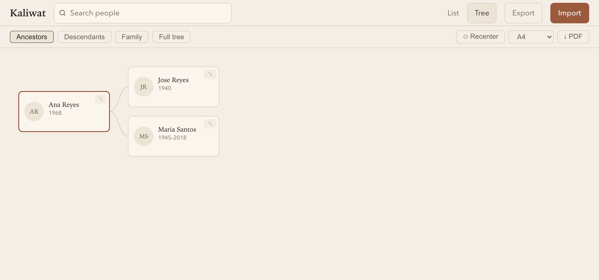
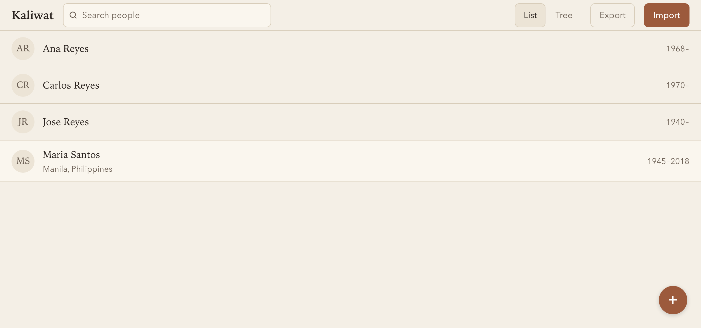

# Kaliwat

Open-source, **browser-only** family tree maker. Angular front end, no backend — your tree data and photos never leave the device unless you export them.

### ▶ [Try the live demo at kaliwat.loable.tech](https://kaliwat.loable.tech/)

No sign-up, no upload — open it and hit **"try a sample tree"** to explore, or import your own `.ged`/`.gdz`.

[](https://kaliwat.loable.tech/)

_Searchable people list with the same sample tree:_

[](https://kaliwat.loable.tech/)

> **Status:** under active development. Import/export, persistence, multiple tree views, editing, and privacy-aware export all work. The full build plan lives in [docs/family-tree-app-plan.md](docs/family-tree-app-plan.md) and remains the source of truth for scope, data model, and milestone order.

## Features

- Build, view, and edit a family tree entirely in the browser — nothing is uploaded.
- Import/export **GEDCOM 5.5.1** (`.ged`) and **GEDZIP** (`.gdz`, a zip bundling GEDCOM + photos), with lossless round-trip (custom tags, sources, and notes from other apps are preserved).
- Photos attached to people, stored as blobs in IndexedDB and round-tripped through `.gdz`.
- Tree views: **pedigree**, **family DAG** (union nodes for marriages), and a **complete tree** layout, with pan/zoom.
- **List view** with diacritic-insensitive search; inline person editing, relationship editing, and delete.
- Kinship/relationship calculator, birthday/anniversary surfacing, and duplicate detection.
- **PDF export** of the rendered tree.
- Privacy-aware export: self-contained **HTML publish** (living people redacted, EXIF/GPS stripped), **passphrase-encrypted** `.gdz` (AES-GCM), and a fail-closed living-person **redaction** model.
- Local persistence (IndexedDB) so a refresh never loses work.
- Offline-capable PWA (hand-rolled service worker + web manifest); self-hostable as static files.

## Stack

Angular 20 (standalone components + signals, no NgRx) · `read-gedcom` for parsing + a hand-rolled serializer · `d3-hierarchy`/`d3-zoom`/`d3-selection` for layout · SVG card rendering · `jszip` for `.gdz` · `jspdf` + `svg2pdf.js` for PDF · Dexie/IndexedDB for the model and photo blobs · GEDCOM parsing runs in a Web Worker.

## Architecture

The normalized TypeScript model is the single source of truth. GEDCOM and photos are I/O at the edges, never the runtime format.

```
.ged/.gdz → parse + unzip → Normalized model (signals) ⇄ IndexedDB (model + blobs)
                                    ↓                          ↑
                          Layout engine → SVG cards    serializer + zip → .ged/.gdz
```

Source layout under `src/app/`: `core/` (model, db, edit, relate, search, dedupe, anniversaries, tree-store), `gedcom/` (parser, normalizer, serializer, gedzip), `media/`, `layout/` (pedigree + DAG), `views/` (list, tree), `ui/`, and `export/` (publish, encrypt, redaction, print).

## Develop

```bash
npm install
npm start        # ng serve — dev server
npm run build    # production build
npm test         # unit tests (Vitest)
npm run e2e      # end-to-end tests (Playwright)
```

## License

[MIT](LICENSE) © Andrew Loable
